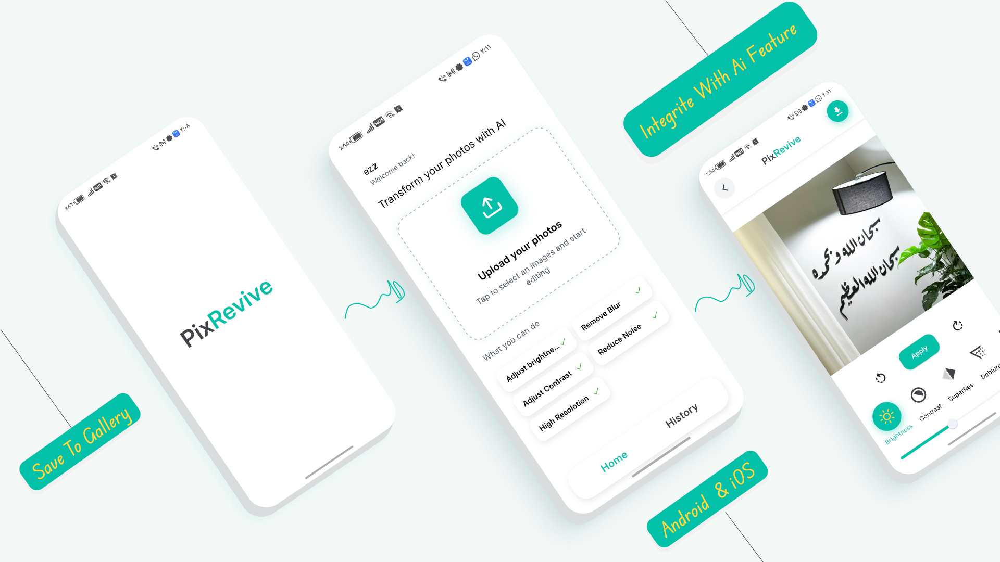
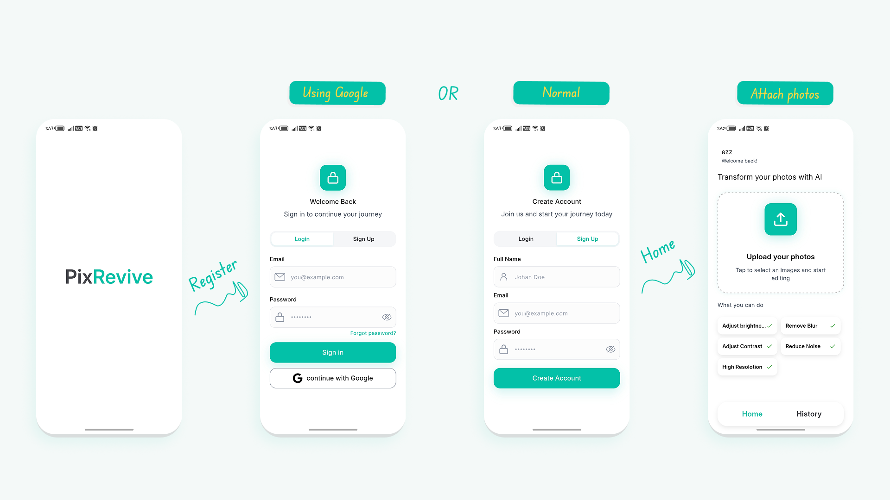

# PixRevive

**A smart app for reviving and restoring photos using AI and image processing technology.**

## 📖 About the App

PixRevive uses advanced AI models and image processing techniques to bring old, blurry, or low-quality photos back to life — enhancing detail, clarity, and color with just a few taps.

---

## 📸 Screenshots

  

  
  

---

## ✨ Core Technical Features

- **Super Resolution** — Upscales low-quality images and enhances fine details using advanced AI models
- **Mathematical Filters** — Precise algorithmic filters to control and refine image appearance
- **Deblur** — Intelligently corrects motion blur and sharpens faded edges
- **Denoise** — Removes digital noise (grain) while preserving the original image's features
- **Professional Lighting Control** — Fine-tuned tools for adjusting brightness and contrast to bring out colors and details

---

## ⚙️ Technical Specifications

- **Instant Processing** — Optimized algorithms ensure filters are applied as quickly as possible
- **Image History** — Saves processed images so users can revisit them later
- **Save to Gallery** — Exports images in the highest possible quality after processing
- **Professional UI** — Clean-code-based design for smooth navigation and performance

---

## 🚀 Getting Started
*(Add setup/installation instructions here — e.g., prerequisites, how to clone, install dependencies, and run the app)*

## 🛠️ Built With
Flutter — cross-platform app framework
Django — backend framework for AI model integration and API handling

## 📄 License
All rights reserved © Abdulrahman Mohamed Hammad. This code is publicly visible for portfolio/demonstration purposes only. You may **not** copy, modify, redistribute, or reuse any part of this code or its assets without explicit written permission from the author.
